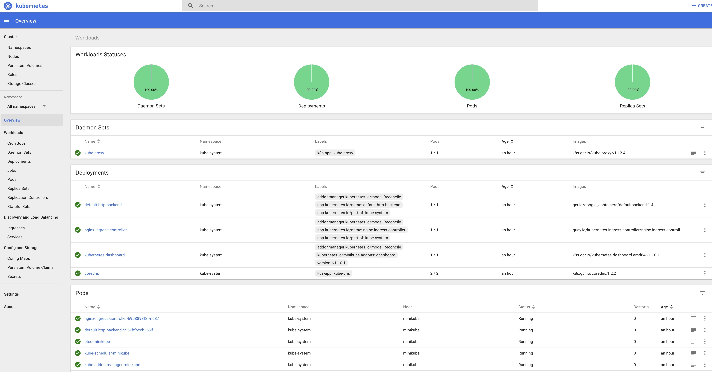

# Getting started with Minikube

## Overview

A practical introduction to the [Kubernetes concepts](https://kubernetes.io/docs/concepts/) used by the GDS Supported Platform using [Minikube](https://github.com/kubernetes/minikube).

Concepts include [Helm Charts](https://docs.helm.sh/developing_charts/), [Deployments](https://kubernetes.io/docs/concepts/workloads/controllers/deployment/), [Services](https://kubernetes.io/docs/concepts/services-networking/service/) and [Ingresses](https://kubernetes.io/docs/concepts/services-networking/ingress/)


## Exercise
Create a [Helm chart](https://docs.helm.sh/developing_charts/) for a simple "hello world" application based on nginx that can be deployed to a local Kubernetes cluster.

This exercise will take between 30-60 minutes and will cover:

*  [Setting up a local Kubernetes cluster using Minikube](#setting-up-a-local-kubernetes-cluster-using-minikube)
*  [Creating a Deployment](#creating-a-deployment)
*  [Creating a Service](#creating-a-service)
*  [Creating an Ingress](#creating-an-ingress)
*  [Check your Application log files](#check-your-application-log-files)
*  [Scaling the Application](#scaling-the-application)
*  [Uninstalling the Application and Kubernetes cluster](#uninstalling-the-application-and-kubernetes-cluster)


### Setting up a local Kubernetes cluster using Minikube

Install [Homebrew](https://brew.sh/) (if required) to install dependencies.

```
/usr/bin/ruby -e "$(curl -fsSL https://raw.githubusercontent.com/Homebrew/install/master/install)"
```

Install Minikube and dependencies using [Homebrew](https://brew.sh/)

```
brew cask install virtualbox  # if it fails, go to system preferences > security and allow Oracle access at the bottom
brew cask install minikube
brew install kubernetes-cli
brew install kubernetes-helm
brew install jq
```

Start Minikube with an [Ingress](https://kubernetes.io/docs/concepts/services-networking/ingress/) controller

```
minikube start --vm-driver virtualbox
minikube addons enable ingress
minikube addons list
```

Check Minikube is running

```
minikube status
```

Check that we can access our Minikube cluster using `kubectl`

```
kubectl get nodes
```

Check out Minikube using the Kubernetes web dashboard

```
minikube dashboard  --url     # get the web address of the dashboard
minikube dashboard            # launch dashboad in default browser
```



### Creating a Deployment

Create a directory that will contain our "Chart" (a collection of Kubernetes resources)

```
mkdir myapp
cd myapp
```

A chart is a simple directory with "Chart.yaml" file, "values.yaml" file and a templates dir like:

```
.
├── Chart.yaml
├── templates
└── values.yaml
```

So let's create these files ....create a Chart.yaml file that will define some metadata about this chart

```
apiVersion: v1
appVersion: "1.0"
description: My first helm chart
name: myapp
version: 0.1.0
```

Create a "templates" directory which will contain all of our Kubernetes object definitions

```
mkdir templates
```

Create an values.yaml file that can be used to set defaults for any variables we might use in our chart containing

```
replicas: 2 	# the number of pods
```

This sets the default number of pods to create and is referenced in the deployment template using ``{{ .Values.replicas }}``.

ok, we now have the boilerplate for an empty "Chart" and can start defining Kubernetes resources

First we will create a Deployment which will ensure than N replicas (instances) of our application container will be running. In this case the default is 2 as defined in `values.yaml` however this may be overridden.

We will use an "nginx" container image to play the role of our application, but you could replace this with another Docker image if you want:

Create a minimal `templates/deployment.yaml` that looks like:

```
apiVersion: apps/v1beta2
kind: Deployment
metadata:
  name: {{ .Release.Name }}-myapp
  labels:
    app.kubernetes.io/name: myapp
    app.kubernetes.io/instance: {{ .Release.Name }}
spec:
  replicas: {{ .Values.replicas }}
  selector:
    matchLabels:
      app.kubernetes.io/name: myapp
      app.kubernetes.io/instance: {{ .Release.Name }}
  template:
    metadata:
      labels:
        app.kubernetes.io/name: myapp
        app.kubernetes.io/instance: {{ .Release.Name }}
    spec:
      containers:
        - name: myappcontainer
          image: "nginx:latest"
          ports:
            - name: http
              containerPort: 80
              protocol: TCP
```

The `{{ .Release.Name }}` variables will be populated when we "render" the chart.
The ``{{ .Values.replicas }}`` variable is populated from the contents of the `values.yaml` file.

Test out rendering the chart using the `helm template` command like:

```
helm template --name example .
```

you should see the rendered version of the Kubernetes objects dumped to stdout

instead of dumping to stdout, we can write the output to a directory:

```
mkdir output
helm template --name example --output-dir=output .
```

we can now use `kubectl` to "apply" the contents of the "output" dir to our Minikube cluster

```
kubectl apply -R -f output/
```

`apply` means, install the declarations into the cluster

The `-R` flag means, find all the Kubernetes resource definitions recursively in the directory specified by the `-f` flag

We should now be able to list the deployments installed in the cluster with:

```
kubectl get deployments
```

The Deployment will manage the creation of Pods for our app image

To check the state of pods do

```
kubectl get pods
```


Which should show something like

```
NAME                                   READY   STATUS           RESTARTS   AGE
example-myapp-6d76dc8fbb-ptnm9         1/1     Running          0          25s
example-myapp-c8fbb6d76d-44nm9         1/1     Running          0          25s
```

If you see a status of something other than `Running`, then you may have to try again in a few seconds

... ok so we now have 2x Pods running instances of our app (nginx) in the cluster, but all Pods in the cluster are running on an internal only network and as such it is not accessible from the outside.

We can tunnel into the cluster using `kubectl port-forward` to check if our Pod is serving requests:

```
kubectl port-forward deployment/example-myapp 8080:80
```

This will tunnel http://localhost:8080 -> into the cluster -> pod ... so you can use a browser to check it's returning the "welcome to nginx" default page

### Creating a Service

Tunnelling into the cluster isn't a very practical way to expose your service so let's improve that.

The first thing we need to do is add a `Service` definition to our Chart.

Create a `templates/service.yaml` file like:

```
apiVersion: v1
kind: Service
metadata:
  name: {{ .Release.Name }}-myapp
  labels:
    app.kubernetes.io/name: myapp
    app.kubernetes.io/instance: {{ .Release.Name }}
spec:
  type: ClusterIP
  ports:
    - port: 80
      targetPort: http
      protocol: TCP
      name: http
  selector:
    app.kubernetes.io/name: myapp
    app.kubernetes.io/instance: {{ .Release.Name }}
```

The `Service` will act like a mini internal load-balancer giving us a single internal endpoint that points to each running Pod that matches the labels in the `selector` description.

We'll need to re-render our template...

```
helm template --name=example --output-dir=output .
```

...and re-apply it to the cluster...

```
kubectl apply -R -f output/
```

As before we can use `kubectl port-forward` to tunnel this time to the `Service` endpoint to check it's working:

```
kubectl port-forward service/example-myapp 8080:80
```

### Creating an Ingress

This still hasn't helped us expose our app to the public, but has given us a stable endpoint to direct traffic to

To route traffic from the public we need to define an `Ingress` record.

Create a `templates/ingress.yaml` file:

```
apiVersion: extensions/v1beta1
kind: Ingress
metadata:
  name: {{ .Release.Name }}-myapp
  annotations:
    nginx.ingress.kubernetes.io/rewrite-target: "/"
spec:
  rules:
  - host: www.myapp.com
    http:
      paths:
      - backend:
          serviceName: example-myapp
          servicePort: 80
        path: /
```

Re-render the Chart and re-apply to the cluster (we'll do it in one go this time just for fun):

```
helm template --name=example . | kubectl apply -f -
```

Check the ingress is created:

```
kubectl get ingress
```

Which should show something like:

```
kubectl get ingress
NAME            HOSTS           ADDRESS     PORTS   AGE
example-myapp   www.myapp.com   10.0.2.15   80      3m31s
```

Our ingress route should now be working and routing traffic for the `www.myapp.com` host from the exposed Minikube IP to our Service and on to our Pods running nginx... we can test this using curl:

```
curl -k -H 'Host: www.myapp.com' http://$(minikube ip)/
```

The `minikube ip` command will return the IP address of the Minikube virtual machine, which is the ingress point. We add a `Host: www.myapp.com` header to the request so that our request is correctly routed.


Which should show the "Thank you for using nginx" message!

```
<!DOCTYPE html>
<html>
<head>
<title>Welcome to nginx!</title>
<style>
    body {
        width: 35em;
        margin: 0 auto;
        font-family: Tahoma, Verdana, Arial, sans-serif;
    }
</style>
</head>
<body>
<h1>Welcome to nginx!</h1>
<p>If you see this page, the nginx web server is successfully installed and
working. Further configuration is required.</p>

<p>For online documentation and support please refer to
<a href="http://nginx.org/">nginx.org</a>.<br/>
Commercial support is available at
<a href="http://nginx.com/">nginx.com</a>.</p>

<p><em>Thank you for using nginx.</em></p>
</body>
</html>

```

### Check your Application log files
You can check the logs of your application using

```
kubectl logs -f example-myapp-768cd7d675-zmr6vkubectl
```

The `-f` switch steams updates from the log as they happen and the pod name is the value you find in the output from `kubectl get pods`

```
72.17.0.2 - - [10/Jan/2019:11:10:12 +0000] "GET / HTTP/1.1" 304 0 "-" "Mozilla/5.0 (Macintosh; Intel Mac OS X 10_13_6) AppleWebKit/537.36 (KHTML, like Gecko) Chrome/71.0.3578.98 Safari/537.36" "192.168.99.1"
172.17.0.2 - - [10/Jan/2019:11:12:44 +0000] "GET / HTTP/1.1" 200 612 "-" "curl/7.54.0" "192.168.99.1"
172.17.0.2 - - [10/Jan/2019:11:13:03 +0000] "GET / HTTP/1.1" 200 612 "-" "curl/7.54.0" "192.168.99.1"
```

### Scaling the Application

Now lets scale our deployment up to ten nginx instances. We can override the replicas setting during the templating as folllows:

```
helm template --name=example --set-string replicas=10 .
```

variables passed using `--set-string` override the default in the `values.yaml` file.
Note the default replicas setting is now set to 10 in the generated yaml

```
---
# Source: myapp/templates/service.yaml
apiVersion: v1
kind: Service
metadata:
  name: example-myapp
  labels:
    app.kubernetes.io/name: myapp
    app.kubernetes.io/instance: example
spec:
  type: ClusterIP
  ports:
    - port: 80
      targetPort: http
      protocol: TCP
      name: http
  selector:
    app.kubernetes.io/name: myapp
    app.kubernetes.io/instance: example
---
# Source: myapp/templates/deployment.yaml
apiVersion: apps/v1beta2
kind: Deployment
metadata:
  name: example-myapp
  labels:
    app.kubernetes.io/name: myapp
    app.kubernetes.io/instance: example
spec:
  replicas: 10
  selector:
    matchLabels:
      app.kubernetes.io/name: myapp
      app.kubernetes.io/instance: example
  template:
    metadata:
      labels:
        app.kubernetes.io/name: myapp
        app.kubernetes.io/instance: example
    spec:
      containers:
        - name: myappcontainer
          image: "nginx:latest"
          ports:
            - name: http
              containerPort: 80
              protocol: TCP

---
# Source: myapp/templates/ingress.yaml
apiVersion: extensions/v1beta1
kind: Ingress
metadata:
  name: example-myapp
  annotations:
    nginx.ingress.kubernetes.io/rewrite-target: "/"
spec:
  rules:
  - host: www.myapp.com
    http:
      paths:
      - backend:
          serviceName: example-myapp
          servicePort: 80
        path: /

```

So we can now scale up to ten instances using

```
helm template --name=example --set-string replicas=10 .  | kubectl apply -f -
```

Check the running pods to confirm there are in fact ten instances
```
kubectl get pods
```

```
NAME                             READY   STATUS    RESTARTS   AGE
example-myapp-768cd7d675-2vwxg   1/1     Running   0          3m37s
example-myapp-768cd7d675-8gwnn   1/1     Running   0          3m37s
example-myapp-768cd7d675-9fvgd   1/1     Running   0          3m37s
example-myapp-768cd7d675-fj2nw   1/1     Running   0          3m37s
example-myapp-768cd7d675-pfgmv   1/1     Running   0          3m37s
example-myapp-768cd7d675-qpvfz   1/1     Running   0          3m37s
example-myapp-768cd7d675-qw4lj   1/1     Running   0          3m37s
example-myapp-768cd7d675-rcjjp   1/1     Running   0          3m37s
example-myapp-768cd7d675-tvvwq   1/1     Running   0          3m37s
example-myapp-768cd7d675-zsdm7   1/1     Running   0          3m37s

```

Now lets scale back to 3 pods


```
helm template --name=example --set-string replicas=3 .  | kubectl apply -f -
```
Check the running pods again to confirm that there are now three
```
kubectl get pods
```

```
NAME                             READY   STATUS    RESTARTS   AGE
example-myapp-768cd7d675-2vwxg   1/1     Running   0          5m14s
example-myapp-768cd7d675-qw4lj   1/1     Running   0          5m14s
example-myapp-768cd7d675-tvvwq   1/1     Running   0          5m14s
```

### Uninstalling the Application and Kubernetes cluster

Finally we can remove our deployment, the instances, the service and the ingress

```
helm template --name=example --set-string replicas=3 .  | kubectl delete -f -
```

```
service "myapp" deleted
deployment.apps "myapp" deleted
ingress.extensions "myapp" deleted
```

```
kubectl get pods
```
which confirms that its all gone
```
No resources found.
```

Finally we can stop Minikube

```
minikube stop
```

If required we can remove all the software

```
brew cask uninstall virtualbox
brew cask uninstall minikube
brew uninstall kubernetes-cli
brew uninstall kubernetes-helm
brew uninstall jq
```

DONE

---
## References

|Topic|Description|
|----|-----------|
|[helm](https://docs.helm.sh/)| Helm package manager for Kubernetes|
|[jq](https://stedolan.github.io/jq/manual/)| json wrangling filter |
|[kubectl](https://kubernetes.io/docs/tasks/tools/install-kubectl/)| Kubernetes command line tool|
|[kubernetes](https://kubernetes.io/docs/home/?path=users&persona=app-developer&level=foundational)| Kubernetes |
|[kubernetes cheatsheet](https://cheatsheet.dennyzhang.com/cheatsheet-kubernetes-A4)|Handy Kubernetes cheatsheet|
|[minikube](https://github.com/kubernetes/minikube)|local Kubernetes |
|[minikube cheatsheet](https://cheatsheet.dennyzhang.com/cheatsheet-minikube-A4)|Handy cheatsheet for Minikube|
|[virtualbox](https://www.virtualbox.org/manual/UserManual.html)|hypervisor
